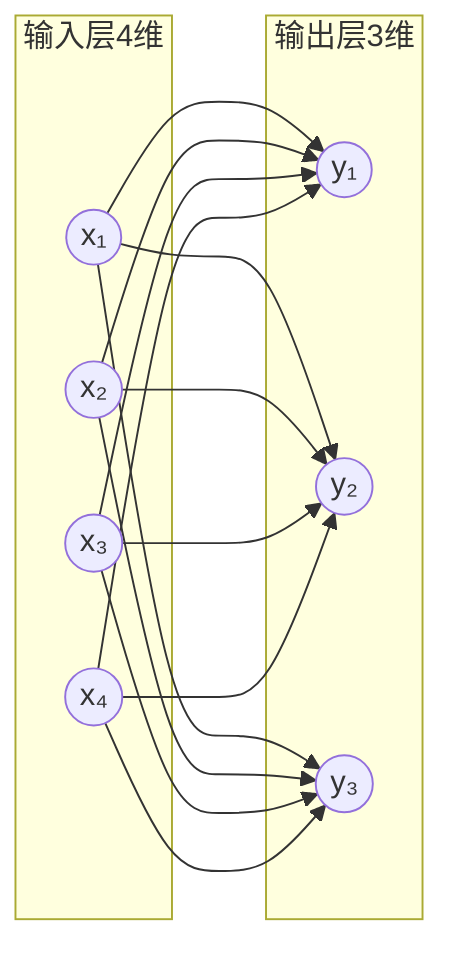

# learn_nero_networks
code for learning nero network models

```mermaid
graph LR
    subgraph 输入层4维
        x1((x₁))
        x2((x₂))
        x3((x₃))
        x4((x₄))
    end
    subgraph 输出层3维
        y1((y₁))
        y2((y₂))
        y3((y₃))
    end
    x1 --> y1
    x1 --> y2
    x1 --> y3
    x2 --> y1
    x2 --> y2
    x2 --> y3
    x3 --> y1
    x3 --> y2
    x3 --> y3
    x4 --> y1
    x4 --> y2
    x4 --> y3
```